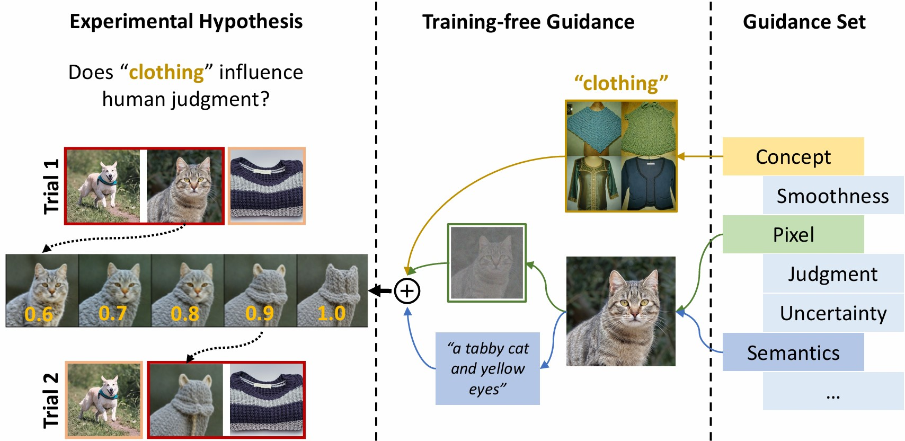
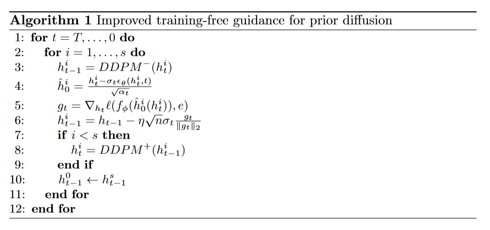
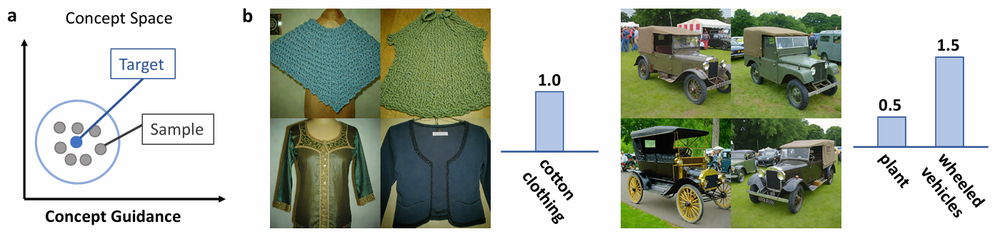
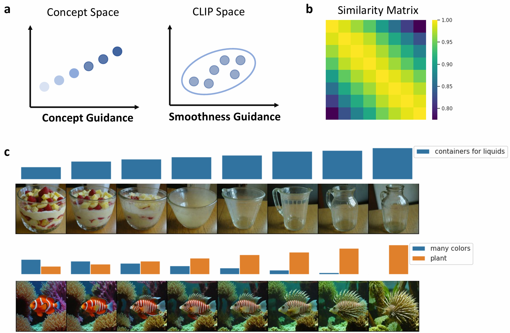
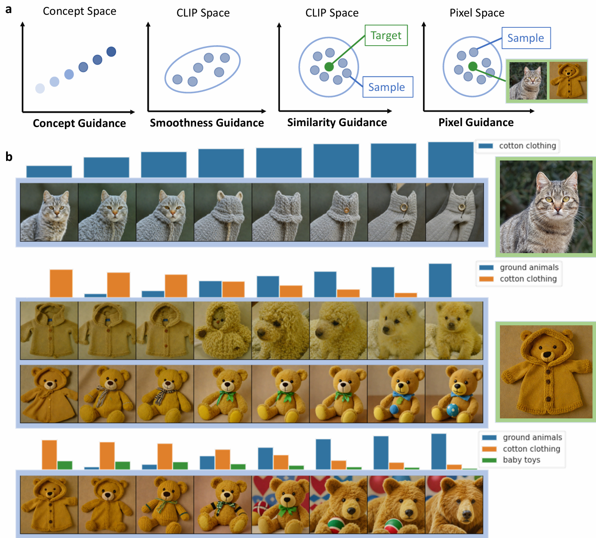
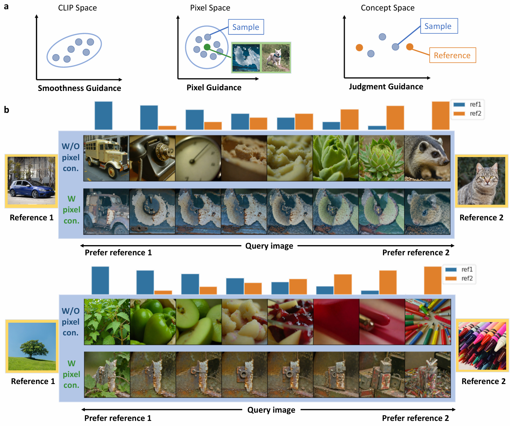

<div align="center">

<h2 style="border-bottom: 1px solid lightgray;">CoCoG-2: Controllable generation of visual stimuli for understanding human concept representation</h2>

<!-- Badges and Links Section -->
<div style="display: flex; align-items: center; justify-content: center;">

<p align="center">
  <a href="#">
  <p align="center">
    <a href='https://arxiv.org/abs/2407.14949'></a>
    <a href='https://github.com/ncclab-sustech/CoCoG'></a>

  </p>
</p>

</div>

</div>



## Introduction

**CoCoG Framework:**
The concept-based controllable generation (CoCoG) framework uses concept embeddings to generate visual stimuli that can influence decision-making behaviors. Despite its benefits, CoCoG lacked flexibility in editing and guiding visual stimuli based on varying concept dimensions without compromising other image features.

**Introducing CoCoG-2:**
To overcome these limitations, we introduce the CoCoG-2 framework. CoCoG-2 employs a training-free guidance algorithm, enhancing the flexibility and accuracy in manipulating concept representations. This approach allows for more precise control and integration of experimental conditions.

**Key Contributions:**
- Enhanced Framework: We propose a general framework for designing experimental stimuli based on human concept representations and integrating experimental conditions through training-free guidance.
- Guidance Strategies: We have verified a variety of potential guidance strategies for guiding the generation of visual stimuli, controlling concepts, behaviors, and other image features.
- Validation of Hypotheses: Our results demonstrate that visual stimuli generated by combining different guidance strategies can validate a variety of experimental hypotheses and enrich our tools for exploring concept representation.

## Method

**Training-free guidance:**

In CoCoG-2, we simplified the distribution to *p(x, h, e) = p(e)p(h|e)p(x|h)*, where e includes essential conditions such as concepts and similarity judgments. In CoCoG-2 concept decoder, we continue using a two-stage process, starting with *p(h|e)* modeled as Prior Diffusion and then *p(x|h)* using CLIP guidance. This approach enhances the model's flexibility by introducing training-free guidance in the Prior Diffusion phase, allowing for effective control over the generation of visual stimuli by selecting appropriate conditions *e*.

In order to ensure the stability and effectiveness of training-free guidance, we use two technologies, *Adaptive gradient scheduling* and *Resampling trick*, to enhance training-free guidance. The algorithm is shown in Figure 1.

<figure>
  
  <figcaption style="text-align: center; font-weight: bold;">Figure 1: Improved training-free guidance for prior diffusion.</figcaption>
</figure>

<div style="margin-top: 10px;"></div>

**Guidance set:**

To construct a comprehensive loss function, we aim to fulfill multiple conditions simultaneously in the generative process. We define seven types of guidance—*concept, smoothness, semantics, judgment, uncertainty, and pixel guidance*—to ensure that the visual stimuli meet our specified requirements.

<!-- This adds space between the figures -->
<div style="margin-top: 30px;"></div>

## CoCoG-2 for versatile experiment design

<!-- This adds space between the figures -->
<div style="margin-top: 10px;"></div>

**Diverse generation based on concept:**
- CoCoG-2 can generate images that are well-aligned with the target concepts, and these images exhibit good diversity in low-level features.

<figure>
  
  <figcaption style="text-align: center; font-weight: bold;">Figure 2: Generate diverse visual stimuli for given target concepts. (a) Concept guidance used in this experiment. (b) Visual stimuli generated under the guidance of one or more target concepts.</figcaption>
</figure>

<!-- This adds space between the figures -->
<div style="margin-top: 30px;"></div>

**Smooth changes based on concepts:**
- CoCoG-2 can modify the activation values of target concepts to generate image trials while maintaining smooth low-level features.

<figure>
  
  <figcaption style="text-align: center; font-weight: bold;">Figure 3: The smooth change of visual stimuli generated based on concept. (a) Concept guidance and Smoothness guidance used in this experiment. (b) The average CLIP similarity matrix of 100 random image trials. (c) Two trials of images generated under the guidance of one or more target Concepts.</figcaption>
</figure>

<!-- This adds space between the figures -->
<div style="margin-top: 30px;"></div>

**Concept edit of given image:**
- CoCoG-2 can start with an "original image" and edit target concepts to generate image trials that are similar to the original image and vary the concepts according to given values.

<figure>
  
  <figcaption style="text-align: center; font-weight: bold;">Figure 4: Image trials generated by concept editing of a given image. (a) Concept, Smoothness, Semantics, and Pixel guidance used in this experiment. (b) A trial of images generated under the guidance of a single concept (row 1); Trials of images generated by CoCoG-2 and CoCoG under the guidance of multiple concepts (row 2-4). When guided only by "ground animals" and "cotton clothing," the images generated by CoCoG-2 align well with the target concepts. However, the images generated by CoCoG cannot produce real animals due to conflicts between target concepts and the concept "baby toys" in the original image, necessitating manual adjustment of the "baby toys" value.</figcaption>
</figure>

<!-- This adds space between the figures -->
<div style="margin-top: 30px;"></div>

**Multi-path control of similarity judgment:**
- CoCoG-2 can directly generate image trials guided by experimental results, while maintaining consistency with the guided image (if available) in shape, color, and other low-level features.

<figure>
  
  <figcaption style="text-align: center; font-weight: bold;">Figure 5: Control pathways of similarity judgments with/without Pixel guidance. (a) Smoothness, Pixel, and Judgment guidance used in this experiment. (b) Images generated under the guidance of probability interpolation of two pairs of references. The top row of images for each set is generated without using the pixel guidance, while the bottom row of images is generated with the pixel guidance.</figcaption>
</figure>

<!-- This adds space between the figures -->
<div style="margin-top: 30px;"></div>

**Optimal design for individual preference:**
- CoCoG-2 can be used to design and generate visual stimuli that maximize information gain, thereby substantially reducing the number of experiments required in cognitive research.

<figure>
  
  <figcaption style="text-align: center; font-weight: bold;">Figure 6: Generated images containing rich individual preference information. (a) Uncertainty guidance used in this experiment. (b) Probability distributions of three sets of generated images in c, with each side of the triangle representing the probability of choosing a particular image as the odd one out. (c) Images generated under the guidance of Uncertainty guidance for three pairs of references.</figcaption>
</figure>

<!-- This adds space between the figures -->
<div style="margin-top: 30px;"></div>

## Conclusion

The CoCoG-2 framework represents a significant advancement in the field of controllable visual object generation. It effectively combines concept representations with behavioral insights to guide the image generation process, addressing the limitations of the original CoCoG framework and enhancing flexibility and efficiency.

- **Integration of Concepts and Behavior**: CoCoG-2 integrates concept representations with behavioral outcomes, improving the relevance and utility of generated visual stimuli in cognitive research.
- **Enhanced Flexibility and Efficiency**: By employing a versatile experiment designer and meticulously designed guidance strategies, CoCoG-2 achieves greater flexibility and efficiency in visual stimulus generation.

## Code

### Get started
You can set up a conda environment with all dependencies by running the following commands:

```
conda env create -f cocog.yml
conda activate cocog
```

### Demo examples

**Demo 1: Diverse generation based on concept**
- Demo `exp1-diverse_generation.ipynb` generates diverse visual stimuli for given target concepts.

**Demo 2: Smooth changes based on concepts**
- Demo `exp2-smooth_concept.ipynb` generates smoothly changing visual stimuli based on concepts.

**Demo3: Image editing in concept**
- Demo `exp3-concept_editing.ipynb` generates visual stimuli by image editing in concept.

**Demo4: Behavioral manipulation of similarity judgment**
- Demo `exp4-behavioral_manipulation.ipynb` generates visual stimuli to manipulate behavior of similarity judgments.

**Demo5: Optimal design for individual preference**
- Demo `exp5-uncertainty_trial.ipynb` generates trials of similarity judgment leading to rich individual preference information.